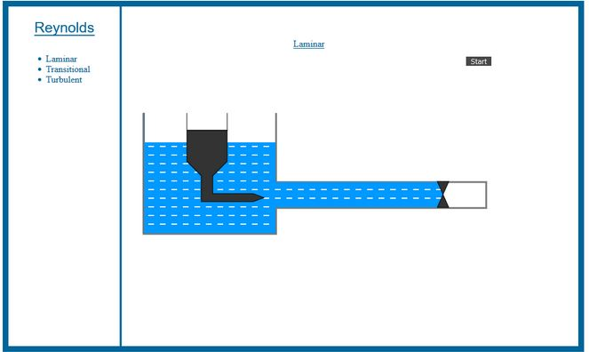
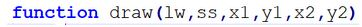
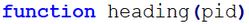
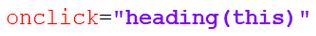
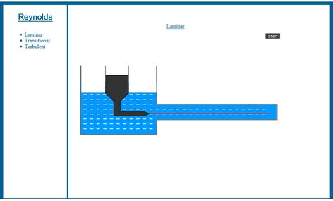
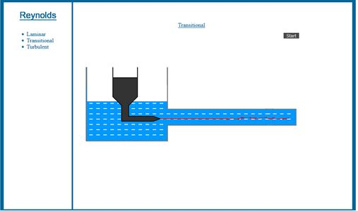
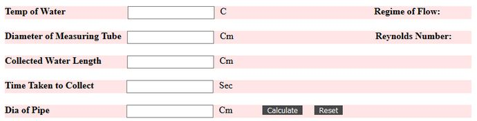

**Experiment Code Documentation**

**Introduction**

This document captures the experiment implementation details.

**Code Details**

The package mainly used for this simulation is **Canvas.** The canvas width and height has been set to the window size.

- **Function-drawMain**

 

   **Fig 1-Static simulator**

**What it does-** This function is used for the outline and filling of the 2d drawing i.e to build a static drawing using coordinates as shown in fig-1.

**Arguments-** None

- **Function-draw**

 
                                
**Fig 2-The draw function**

**What it does-** This function is used as a generalized function for drawing of lines.

**Arguments-**

**lw-** line width

**Ss-** stroke style

**x1,y1-** Origin coordinate

**x2,y2-** Destination coordinate

-  **Function-heading**

 

   **Fig 3-The heading function**

**What it does** -This function is used to change the heading of the simulation as per the selected flow.

**Arguments-**

**pid-** This argument takes in the current instance of the object passed from html through onclick as shown in fig 4.

 

**Fig 4**

- **Function-disappear**

**What it does-** This function is used to simulate removal of the knob to allow water and dye flow.

**Arguments-** None

- **Function-laminarLine**

**What it does-** This function is used to simulate the flow of dye from the dye container when there is a laminar flow.

**Arguments-** None

- **Function-laminarAnimate**

**What it does** -It produces an animation of flowing water(Laminar) through the pipe.

**Arguments-** None

 

**Fig 7-laminarAnimate and laminarFlow**

- **Function-laminarDisappear**

**What it does**- It calls disappear(),laminarLine(),laminarAnimate() functions.

**Arguments-** None

- **Function-transitionalLine**

**What it does-** This function is used to simulate the flow of dye from the dye container when there is a transitional flow.

**Arguments-** None

- **Function-transitionalAnimate**

**What it does-** It produces an animation of flowing water(Transitional) through the pipe.

**Arguments-** None

  

   **Fig 7-transitionalAnimate and transitionalFlow**

- **Function-transitionalDisappear**

**What it does-** It calls disappear(),transitionalLine(),transitionalAnimate() functions.

**Arguments-** None

- **Function-turbulentLine**

**What it does-** This function is used to simulate the flow of dye from the dye container when there is a turbulent flow.

**Arguments-** None

- **Function-turbulentAnimate**

**What it does-** It produces an animation of flowing water(Turbulent) through the pipe.

**Arguments-** None

 **Fig 7-turbulentAnimate and turbulentFlow**

- **Function-turbulentDisappear**

**What it does-** It calls disappear(),turbulentLine(),turbulentAnimate() functions.

**Arguments-** None

**Functions implementing calculations**

- **Function-main**

**What it does-** This function has conditional statements and based upon the user selection(among laminar,transitional and turbulent) if calls the appropriate functions to produce requested animations along with disabling the start button.

**Arguments-** None

- **Function-getData**

**What it does-** This function extracts entered values in the text boxes in the calculations part.It also extracts non digit values if exists.If any non digit values exist or any zero value is entered by the user then this function alerts accordingly with the help of conditionals and also sets a flag to indicate an error has been occured.

**Arguments-** None

- **Function-rno**

**What it does-** This function calls the getData and therefore gets all the entered values and if no error exists it calculates the value of reynolds number and sets it to the predefined element in html through it&#39;s id.

**Arguments-** None

- **Function regime**

**What it does-** Based on the calculations performed in the rno function it displays  appropriate flow type name.

**Arguments-** reynum

reynum is the reynolds number set by rno function.

- **Function reset**

**What it does-** It resets all the text fields to blank.

**Argument-** None.

 

   **Fig-9 Calculations**

**Other details:**

**Formulas used in the Experiment**

Reynolds number–Re=VD/ ν

**Manual link:** [http://eerc03-iiith.vlabs.ac.in/exp10/7.Reynolds\_experiment.pdf](http://eerc03-iiith.vlabs.ac.in/exp10/7.Reynolds_experiment.pdf)
