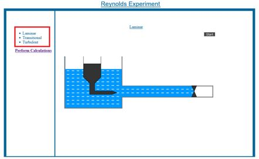
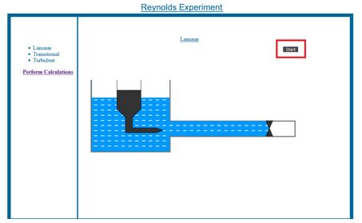
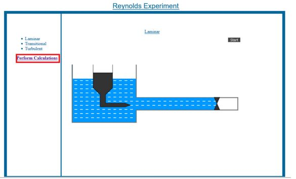

**Experiment Procedure Documentation**

**Introduction**

This document captures the instructions to run the simulation.

**Instructions**

1. To run the experiment, simply run the index.html file by clicking on it and the experiment will open in the browser.

 
 
2. Select the required flow type(laminar,transitional or turbulent) by clicking on the corresponding flow type names available on the left side of the simulator.

     
3.Click on the start button to start the simulation of the selected flow type.Click on other flow type for switching  between the flow types(current simulation need to complete for switching).

  
  
4.Click on perform calculations button available on the left side to move to the calculations part.
  

5.Enter the numerics in the corresponding textboxes.Enter only digits and don&#39;t leave any textbox blank.

  
  
6.Click on calculate button to obtain the regime of flow and reynolds number from the given numerics.

7.Click on the reset button to set all the textboxes to blank.
